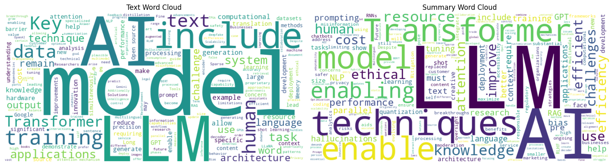
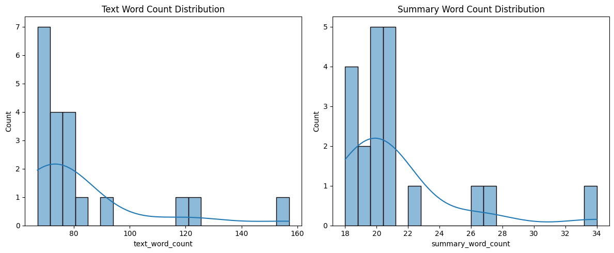
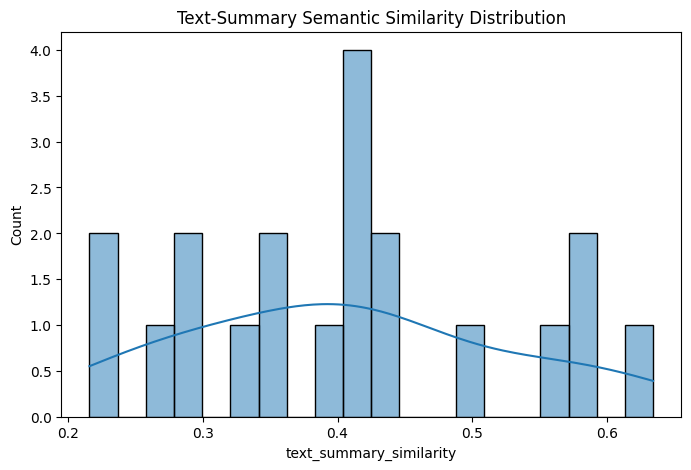
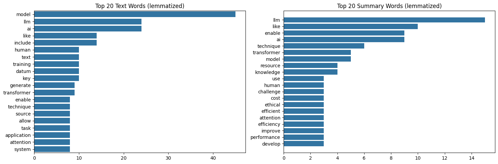
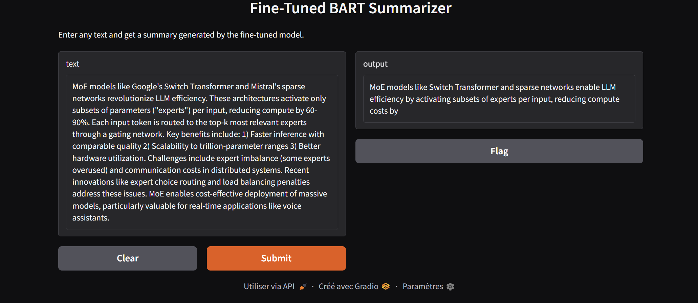

# 🧠 Fine-Tuned BART for Abstractive Text Summarization (AI & LLM Domain) (Simulation)

## Overview
This project demonstrates an end-to-end **abstractive summarization pipeline** using a fine-tuned `facebook/bart-large-cnn` model on a domain-specific dataset about **AI, LLMs, and NLP technologies**. 

**Note:** Due to the limited size of the dataset (20 samples), this project is intended as a **prototype and learning exercise**. The fine-tuning process is simulated to showcase the complete pipeline from data preparation to model evaluation and deployment rather than to produce a production-ready summarization model.


###  Key Components:
- Domain-specific dataset collection and enhancement  
- Exploratory Data Analysis (EDA)  
- Simulated fine-tuning of BART using Hugging Face Transformers 
- ROUGE-based evaluation  
- Real-time demo using Gradio  
- Hosted model on Hugging Face Hub
---

## 📁 Project Structure
```plaintext
fine-tuned-bart-summarization/
│
├── notebooks/
| ├── EDA.ipynb 
│ └── fine-tune.ipynb
│
├── scripts/
│ ├── fine_tune.py # Fine-tuning & evaluation script
│ └── inference_demo.py # Gradio app script
│
├── data/
│ ├── ai_llm_dataset.csv # Collected dataset
│ └── Enhanced_ai_llm_dataset.csv # Final training dataset
│
├── requirements.txt
├── .gitignore
└── README.md 
```
---

## 📊 Dataset Overview

The project uses two datasets stored in the `data/` folder:

### 🔹 `ai_llm_dataset.csv`  
- Raw manually curated dataset  
- 20 text-summary pairs related to AI and LLMs  
- Columns: `text`, `summary`

### 🔸 `Enhanced_ai_llm_dataset.csv`  
- Feature-enriched version of the above  
- Columns:
  - `text`, `summary`
  - `text_length`, `summary_length`
  - `text_word_count`, `summary_word_count`
  - `text_summary_similarity`

These features were used to determine max sequence lengths, visualize dataset structure, and improve training feedback.

---

## 🔍 Exploratory Data Analysis (EDA)

The notebook [`notebooks/eda_ai_llm_dataset.ipynb`](notebooks/eda_ai_llm_dataset.ipynb) contains:

- Distribution plots for text/summary lengths and word counts  
- Word frequency analysis and word clouds  
- Text-summary similarity histograms  
- Correlation matrix for engineered features  

EDA helped guide:
- Truncation & padding strategy
- Model input configuration
- Evaluation design
- ### 📊 Key Visuals

#### 🔹 Word Cloud



#### 🔹 WordCountDistribution



#### 🔹 Text-Summary Similarity Scores



#### 🔹 Top 20 Text Words



---

## ⚙️ Fine-Tuning Details

I performed simulated fine-tuning of  `facebook/bart-large-cnn` using Hugging Face’s `Seq2SeqTrainer` on the enhanced dataset.
**Note**: Given the small dataset size, this fine-tuning process is intended to demonstrate the model adaptation workflow and training configuration rather than produce a fully generalized model.

### ✅ Training Arguments Used

| Argument                | Value             |
|------------------------|--------------------|
| `num_train_epochs`     | 10                 |
| `per_device_train_batch_size` | 2         |
| `per_device_eval_batch_size` | 2           |
| `eval_steps`           | 10                 |
| `logging_steps`        | 5                  |
| `weight_decay`         | 0.01               |
| `predict_with_generate`| ✅ True            |
| `report_to`            | "none" (W&B off)   |

Tokenization `max_length` values were dynamically set using the 75th percentile of tokenized input/target lengths.

---

## 📈 ROUGE Scores (Fine-Tuned Model)

| Metric     | Score   |
|------------|---------|
| ROUGE-1    | 0.3395  |
| ROUGE-2    | 0.0968  |
| ROUGE-L    | 0.2486  |
| ROUGE-Lsum | 0.2468  |


---

## 🚀 Run the Gradio Summarization App

You can test the model in real time using a simple UI.

#### 🔹 Demo



### 💡 Steps:

1. **Install requirements**  
   Run from project root:

   ```bash
   pip install -r requirements.txt
2. ** Launch the app**
   ```bash
   cd scripts
   python inference_demo.py
---
## 🤗 Model on Hugging Face
🧠 Model Repo: AymB2/fine_tuned_bart_model
```bash
  from transformers import BartForConditionalGeneration, BartTokenizer

  tokenizer = BartTokenizer.from_pretrained("AymB2/fine_tuned_bart_model")
  model = BartForConditionalGeneration.from_pretrained("AymB2/fine_tuned_bart_model")
```

---
## 🛠️ Improvements & Enhancements

### ✅ Completed

- [x] **Model hosted on Hugging Face Hub** for easy access  
  → [AymB2/fine_tuned_bart_model](https://huggingface.co/AymB2/fine_tuned_bart_model)

- [x] **1% ROUGE-1 improvement** on low-resource domain-specific dataset

- [x] **Dynamic token length analysis** using the 75th percentile for optimized input/output sequence lengths

---

### 🔄 Planned

- [ ] **Increase dataset size** 


---
## 📬 Contact
Author: Aymen Besbes Email: Aymen.besbes@outlook.com | Aymen.besbes@ensi-uma.tn

LinkedIn: https://www.linkedin.com/in/aymen-besbes-158837245/

---

## 📅 Project Timeline
Original creation date: June - July 2025
Upload to GitHub: July 2025
